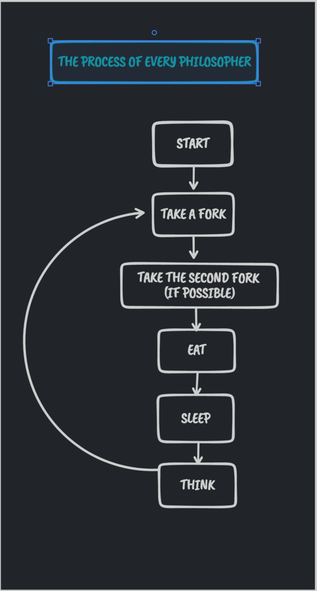

# Philosophers 1337/42 school project

**Philosophers** is a 42/1337 project, which we implemet the **DINING PHILOSOPHERS** problem, Dining philosophers problem A problem to explain the **deadlock state** of the operating system .
This problem was created by ***Etchher Dijkstra in 1965*** .

## Dining philosophers problem

Five philosophers sit at the round table and eat. A fork is placed between the philosophers, and the philosophers eat through the following process. Simply put, if all philosophers grab their left fork at the same time, all philosophers have to wait until their right fork becomes available. But all philosophers do. In this state, all philosophers stay in state 3 forever, and nothing can proceed, which is a deadlock state.
You might think, "You can eat with one fork!", but Rule 4 clearly states that you must hold a fork in both hands to eat. Apparently there were quite a few students who stumbled on this in college classes, and there is a more intuitive version of a fork with a pair of chopsticks .
<div>


</div>

## Usage of the code

```
git clone https://github.com/junik1337/42cursus_Philosophers
cd 42cursus_Philosophers
```
> For mandatory part : (threads and mutex)
```
cd philo/
make
./philo "number_of_philos" "time_to_die" "time_to_eat" "time_to_sleep" "number_of_times_each_philosopher_must_eat(optional argument)"
```
> For bonus part : (processes, threads, semaphore)
```
cd philo_bonus/
make bonus
./philo_bonus "number_of_philos" "time_to_die" "time_to_eat" "time_to_sleep" "number_of_times_each_philosopher_must_eat(optional argument)"
```


